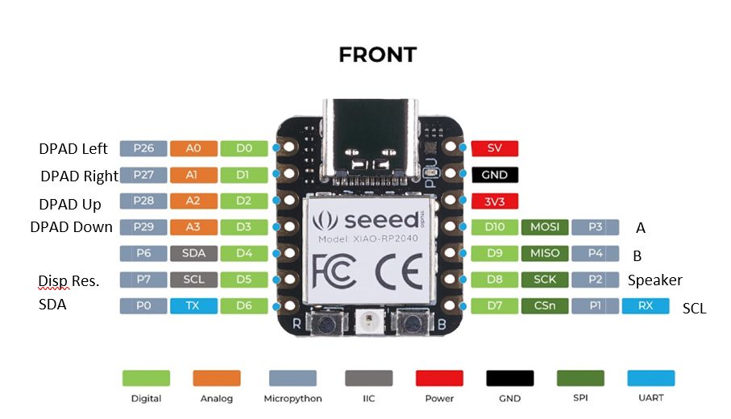

# Thumbotron-API
File modifications to turn your RP2040, 128*64 OLED, and other parts into your very own Thumbotron!  
Run Thumby games with a larger OLED display.


## How to make a Thumbotron

### Hardware
Things you'll need:  
- Some kind of RP2040 board (I used the Seeed XIAO-RP2040)  
- A 128x64 SSD1306 or SSD1309 display.  
- Buttons  
- A speaker  
- Breadboard or perfboard to assemble the Thumbotron on. Hopefully I can design a custom pcb soon ;)  

By default the following pinout is used on the XIAO RP2040:


If you arent using the XIAO RP2040, change the Pin() statements in main.py, lib/thumbyGraphics.py and lib/thumbyHardware to suit your RP2040 board.

### Loading Thumby firmware onto your RP2040 board
1. Hold down the BOOT button on your RP2040 board while plugging in the USB.
2. Download the [ThumbyFirmware.uf2](https://github.com/TinyCircuits/TinyCircuits-Thumby-Code-Editor/raw/master/ThumbyFirmware.uf2) file.
3. Drag and drop the ThumbyFirmware.uf2 to the RPI-RP2 device.
4. Disconnect your RP2040 board.
   
### Modifying Thumby API files
Your RP2040 board is now a Thumby without a working screen or buttons. The following files are modified to support the larger display:
```
   - main.py
   - lib/TCLogo.bin
   - lib/thumbyGraphics.py
   - lib/thumbyHardware.py
```
   
Download the Thumbotron API so you have these files handy.
   
These files need to be replaced on your RP2040 board to match the hardware upgrade :) Here are the steps:
   1. Visit [code.thumby.us](https://code.thumby.us)
   2. Plug in your RP2040 board and click Connect Thumby
   3. Click Upload in the Filesystem tab
   4. Select main.py in your OS files dialog
   5. Select / (root) in the SAVE: CHOOSE A DIRECTORY & NAME dialog box
   6. Click OK
   
Repeat Steps 3-6 for TCLogo.bin, thumbyGraphics.py, and thumbyHardware.py. This time in step 5, **Select /lib instead of / in the SAVE dialog.**
Unplug your RP2040 board and plug it back in, and the display, buttons and speaker should work if wired correctly.

## Good Job!
  
